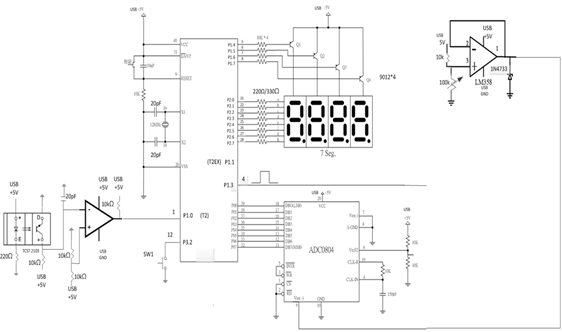

# 8051-7seg-pwm-adc

8051 (AT89S52) assembly firmware using Keil A51: 4-digit 7-segment multiplexing, ADC→voltage display (x.y), Timer-2 pulse counting with 3× blink on `/INT0`, and a 200 Hz PWM on `P1.3` with duty selectable by ID or ADC.

---

## Features
- **4-digit 7-segment scan** (common-anode; segments on `P2`, digit select `P1.4–P1.7` active-low)
- **Voltage (x.y V)** from 8-bit ADC on `P0` (decimal point on DIG3)
- **Pulse counting** on **Timer-2** (`P1.0`), DIG3–DIG4 show the count; **/INT0 (`P3.2`)** triggers **3× blink**
- **200 Hz PWM** on `P1.3`  
  - `P1.2 = 0` → duty from the last two “ID” digits (00 → forced to 55%)  
  - `P1.2 = 1` → duty ≈ `ADC/255` (≈ V/5)

---

## Hardware
- **MCU:** AT89S52 (8052 core), **12 MHz** crystal  
- **Display:** 4-digit **common-anode** 7-segment + transistor drivers  
- **ADC:** 8-bit (e.g., **ADC0804**) → data bus to `P0[7:0]`  
- **Pulse input:** `T2` pin (`P1.0`)  
- **Button:** `/INT0` (`P3.2`) → blink 3×  
- **PWM out:** `P1.3`  
- **Mode pins:**  
  - `P1.2` selects duty source (0 = ID digits, 1 = ADC)  
  - `P1.1` selects display (0 = voltage x.y, 1 = T2 count)

### Schematic

### Pin Map (quick)
1. P2[7:0] -> 7-seg (active-low, CA table)
2. P1.4..P1.7 -> DIG1~DIG4 (active-low)
3. P1.3 -> PWM OUT (200 Hz)
4. P1.2 -> Duty select (0=ID, 1=ADC)
5. P1.1 -> Display select (0=voltage, 1=count)
6. P1.0 (T2) <- Pulse input
7. P3.2 (/INT0)<- Pushbutton (blink 3×)
8. P0[7:0] <- ADC data (e.g., ADC0804 DB0~DB7)
---

## Build & Flash
1. Open **Keil µVision**, create a new 8051 project (target **AT89S52**, 12 MHz).
2. Add `main.asm`, assemble/build.
3. Program the chip (e.g., **PROISP**).
4. Power the board; verify display, PWM (scope), and blink on `/INT0`.

